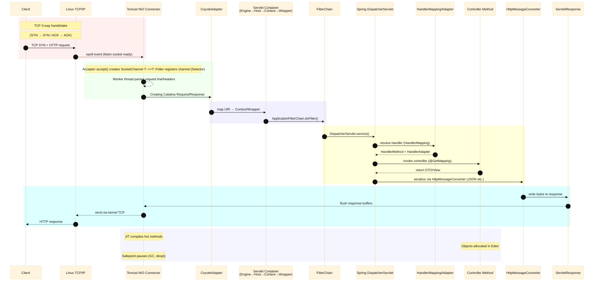

# Spring Framework HTTP Test

## Flow



## Core Terminology

### Network

- **3-way handshake**
  The TCP 3-way handshake is the process used to establish a reliable connection between two endpoints. It consists of three steps:
  1. **SYN**: The client sends a synchronization packet to request a connection.
  2. **SYN/ACK**: The server acknowledges the request and sends its own synchronization packet.
  3. **ACK**: The client acknowledges the server’s response, and the connection is established.
     This happens entirely in the **Linux kernel’s TCP/IP stack** before the application (Tomcat, Java) even sees the connection.

- **Tomcat NIO Connector**
  This is Tomcat’s component that handles network I/O using Java NIO (`java.nio` package).
  It consists of:
  - **Acceptor**: Calls `accept()` to retrieve a socket from the kernel’s accept queue.
  - **Poller**: Registers the socket with a `Selector` and waits for readiness events.
  - **Worker thread**: Reads/parses HTTP requests and passes them to the servlet container.
    NIO allows Tomcat to handle many thousands of connections with fewer threads.

- **epoll event**
  `epoll` is a Linux kernel system call for scalable I/O event notification.
  It lets a process register many file descriptors (e.g., sockets) and wait for them to become ready (readable, writable).
  Tomcat’s NIO **Poller** uses `epoll_wait()` under the hood to detect when a client socket has incoming data or can be written to.

### Tomcat NIO

- **Acceptor**
  - Listens on the server socket for incoming TCP connections.
  - When a client connects, `accept()` is called to create a new `SocketChannel`.
  - Its job is lightweight: just accept and hand off the connection to the `Poller`.
  - Usually runs in one or two dedicated threads.

- **Poller**
  - Monitors multiple `SocketChannel`s for readiness events using a `Selector` (based on Linux `epoll`).
  - Detects when a socket is ready for read or write without blocking.
  - When data is available, it creates a processing task and puts it into the **Worker** queue.
  - Non-blocking I/O allows one Poller thread to handle thousands of connections.

- **Worker**
  - A thread from the Tomcat **Worker Thread Pool**.
  - Retrieves tasks from the queue created by the Poller.
  - Parses HTTP request line and headers, and calls into Tomcat’s higher layers (via `CoyoteAdapter`).
  - Executes the request in the Servlet container / Spring MVC pipeline.

### Servlet Container

- **Engine**
  - The top-level container of Tomcat that processes requests handed off by the connector. It holds virtual hosts and coordinates request routing down the container hierarchy.
- **Host**
  - A virtual host (by hostname) within the Engine, representing a domain like `shop.example.com`. It allows multiple domains to be served by the same Tomcat instance.
- **Context**
  - A single web application (usually one WAR) mounted at a context path like `/app` under a Host. It contains the app’s resources, web.xml, and its servlets/filters/listeners.
- **Wrapper**
  - The container that “wraps” a single servlet (e.g., `DispatcherServlet`). It is the final step in the mapping chain that actually invokes the servlet’s `service()` method.
- **`ApplicationFilterChain.doFilter()`**
  - Executes all servlet filters that apply to the current request in order. Each filter runs its `doFilter()`, and when the chain is exhausted, it finally calls the target servlet’s `service()` (for Spring MVC, the `DispatcherServlet`).

### Spring MVC

- **DispatcherServlet**
  - The front controller in Spring MVC that receives all incoming HTTP requests, delegates to other components to handle them, and produces the HTTP response.
- **HandlerMapping**
  - A component that maps an incoming request to the appropriate handler (such as a controller method) based on URL, HTTP method, and other criteria.
- **HandlerAdapter**
  - A component that knows how to invoke a specific type of handler, performing tasks like parameter binding, validation, and handling the return value.
- **Controller Method**
  - A method inside a controller class, annotated with mappings (e.g., `@GetMapping`, `@PostMapping`), containing the business logic to process the request.
- **HttpMessageConverter**
  - A strategy interface for converting between Java objects and HTTP request/response bodies, handling serialization (e.g., to JSON) and deserialization.

### Response

- **Buffer**
  - A temporary memory area used to store data before it is read or written, allowing more efficient processing by reducing the number of direct I/O operations.

### JVM

- **JIT (Just-In-Time Compilation)**
  - A JVM feature that compiles frequently executed bytecode into native machine code at runtime, improving performance through optimizations such as inlining, loop unrolling, and escape analysis.
- **Eden**
  - A memory region in the Young Generation of the JVM heap where most new objects are initially allocated; short-lived objects are quickly collected, and survivors are promoted to the Old Generation.
- **Safepoint**
  - A state in which all application threads are paused so the JVM can perform global operations such as garbage collection, deoptimization, or class redefinition.


## Logging

### TCP/IP

- Command

Using `Wireshark`, you can capture and analyze network traffic in real-time. In this experiment, Loopback Capture is used to capture traffic on the loopback interface.

- Result

```sh
# === TCP 3-way Handshake ===
1	0.000000000	::1	::1	TCP	94	36224 → 8080 [SYN] Seq=0 Win=65476 Len=0 MSS=65476 SACK_PERM TSval=964089942 TSecr=0 WS=128
   # Client → Server : Connection start request (SYN)
2	0.000014221	::1	::1	TCP	94	8080 → 36224 [SYN, ACK] Seq=0 Ack=1 Win=65464 Len=0 MSS=65476 SACK_PERM TSval=964089942 TSecr=964089942 WS=128
   # Server → Client : Connection accept + acknowledgment (SYN/ACK)
3	0.000025941	::1	::1	TCP	86	36224 → 8080 [ACK] Seq=1 Ack=1 Win=65536 Len=0 TSval=964089942 TSecr=964089942
  # Client → Server : Final ACK, connection established

# === HTTP Request ===
4	0.000071762	::1	::1	HTTP	171	GET /api/http HTTP/1.1
  # Client sends HTTP GET request
5	0.000076062	::1	::1	TCP	86	8080 → 36224 [ACK] Seq=1 Ack=86 Win=65408 Len=0 TSval=964089942 TSecr=964089942
  # Server acknowledges receipt of request

# === HTTP Response ===
6	0.002707963	::1	::1	TCP	338	8080 → 36224 [PSH, ACK] Seq=1 Ack=86 Win=65536 Len=252 TSval=964089945 TSecr=964089942 [TCP segment of a reassembled PDU]
  # Server pushes response data segment (part of JSON body)  
7	0.002714393	::1	::1	TCP	86	36224 → 8080 [ACK] Seq=86 Ack=253 Win=65408 Len=0 TSval=964089945 TSecr=964089945
  # Client acknowledges receipt of response segment
8	0.003036358	::1	::1	HTTP/JSON	91	HTTP/1.1 200  , JSON (application/json)
  # Server sends HTTP 200 OK with JSON payload
9	0.003041058	::1	::1	TCP	86	36224 → 8080 [ACK] Seq=86 Ack=258 Win=65408 Len=0 TSval=964089945 TSecr=964089945
  # Client acknowledges receipt of full response

# === TCP Teardown ===
10	0.003162230	::1	::1	TCP	86	36224 → 8080 [FIN, ACK] Seq=86 Ack=258 Win=65536 Len=0 TSval=964089945 TSecr=964089945
  # Client starts connection termination
11	0.003334562	::1	::1	TCP	86	8080 → 36224 [FIN, ACK] Seq=258 Ack=87 Win=65536 Len=0 TSval=964089945 TSecr=964089945
  # Server agrees to close connection
12	0.003344633	::1	::1	TCP	86	36224 → 8080 [ACK] Seq=87 Ack=259 Win=65536 Len=0 TSval=964089945 TSecr=964089945
  # Client sends final ACK, connection closed
```

- **Key TCP Header Fields & Flags**
  - **Seq (Sequence Number)**: Number assigned to each byte in the stream. Used to keep data in order and detect loss.
  - **Ack (Acknowledgment Number)**: Indicates the next sequence number expected. Confirms receipt of previous bytes.
  - **Win (Window Size)**: Receiver buffer size (flow control). Defines how many bytes can be sent before requiring an ACK.
  - **Len (TCP Segment Length)**: Amount of actual data (payload) carried in this TCP segment.
  - **MSS (Maximum Segment Size)**: Maximum payload size a host is willing to accept in one TCP segment (excluding TCP/IP headers). Negotiated during handshake.
  - **SACK\_PERM (Selective Acknowledgment Permitted)**: Option allowing the receiver to acknowledge non-contiguous segments, improving recovery after packet loss.
  - **TSval (Timestamp Value)**: Sender’s current timestamp. Helps measure RTT (Round Trip Time) and detect retransmissions.
  - **TSecr (Timestamp Echo Reply)**: The timestamp value echoed back from the peer. Used to calculate RTT.
  - **WS (Window Scale)**: Multiplier for the Window Size field, allowing values larger than 65,535 (needed for high-speed networks).

- **TCP Control Flags**
  - **SYN (Synchronize)**: Establish a connection and synchronize sequence numbers.
  - **ACK (Acknowledgment)**: Acknowledge receipt of data or control flags.
  - **FIN (Finish)**: Sender has finished sending data; requests connection termination.
  - **RST (Reset)**: Abruptly abort the connection due to error or invalid state.
  - **PSH (Push)**: Request immediate delivery of data to the application (bypass buffering).
  - **URG (Urgent)**: Marks data as urgent (rarely used in modern systems).


### Socket states (ss)

The `ss` command shows the current state of TCP sockets inside the Linux kernel. It provides a snapshot view of whether a socket is in `LISTEN`, `ESTABLISHED`, `TIME-WAIT`, `CLOSE-WAIT`, etc., and it also displays how many bytes are sitting in the receive queue (data arrived but not yet read by the application) and the send queue (data sent but not yet acknowledged by the peer). This is useful to quickly see if traffic is piling up in the kernel before the application consumes or acknowledges it.

The default timeout value for `TIME-WAIT` state is 60 seconds. This can be viewed by running `cat /proc/sys/net/ipv4/tcp_fin_timeout`.

- Command

```sh
# -t : Show only TCP sockets (exclude UDP, UNIX domain sockets, etc.)
# -i : Show detailed internal TCP information 
#      (Recv-Q, Send-Q, timers, retransmissions, congestion control state, etc.)
# -n : Do not resolve names, show only numeric IP addresses and port numbers
#      (faster and avoids DNS lookups)
# state all : Show sockets in all states (LISTEN, ESTAB, TIME-WAIT, CLOSE-WAIT, etc.)
# dport = :8080 : Filter results where destination port equals 8080
# watch -n 0.01 : Re-run the command every 0.01 seconds (live updating view)
watch -n 0.01 'ss -tin state all dport = :8080'
```

- Result

```sh
State                   Recv-Q                   Send-Q                                     Local Address:Port                                      Peer Address:Port                   Process                                                                                                                                                                                 
ESTAB                   0                        0                                             172.22.0.1:34144                                       172.22.0.2:8080                   
	 cubic wscale:7,7 rto:201 rtt:0.066/0.036 ato:40 mss:1448 pmtu:1500 rcvmss:536 advmss:1448 cwnd:10 bytes_sent:769 bytes_acked:770 bytes_received:305 segs_out:7 segs_in:6 data_segs_out:1 data_segs_in:2 send 1755151515bps lastsnd:30976 lastrcv:30971 lastack:323 pacing_rate 3503667296bps delivery_rate 463360000bps delivered:2 app_limited rcv_space:14480 rcv_ssthresh:64088 minrtt:0.025 snd_wnd:64512
ESTAB                   0                        0                                             172.22.0.1:34152                                       172.22.0.2:8080                   
	 cubic wscale:7,7 rto:200 rtt:0.064/0.032 mss:1448 pmtu:1500 rcvmss:536 advmss:1448 cwnd:10 bytes_acked:1 segs_out:4 segs_in:3 send 1810000000bps lastsnd:30980 lastrcv:30980 lastack:327 pacing_rate 3620000000bps delivered:1 app_limited rcv_space:14480 rcv_ssthresh:64088 minrtt:0.064 snd_wnd:65280
ESTAB                   0                        0                                                  [::1]:50548                                            [::1]:8080                   
	 cubic wscale:7,7 rto:201 rtt:0.034/0.018 ato:40 mss:32732 pmtu:65536 rcvmss:536 advmss:65464 cwnd:10 bytes_sent:769 bytes_acked:770 bytes_received:305 segs_out:7 segs_in:6 data_segs_out:1 data_segs_in:2 send 77016470588bps lastsnd:30983 lastrcv:30978 lastack:30979 pacing_rate 152908613136bps delivery_rate 17457066664bps delivered:2 app_limited rcv_space:65476 rcv_ssthresh:65476 minrtt:0.015 snd_wnd:64768
ESTAB                   0                        0                                                  [::1]:50552                                            [::1]:8080                   
	 cubic wscale:7,7 rto:202 rtt:0.012/0.006 mss:32732 pmtu:65536 rcvmss:536 advmss:65464 cwnd:10 bytes_acked:1 segs_out:4 segs_in:3 send 218213333333bps lastsnd:30990 lastrcv:30990 lastack:30990 pacing_rate 436426666664bps delivered:1 app_limited rcv_space:65476 rcv_ssthresh:65476 minrtt:0.012 snd_wnd:65464
```

### Tomcat NIO

### Syscall timeline (strace/perf)

Tracing tools such as `strace` or `perf trace` capture the sequence of system calls that a process makes to the kernel. This produces a timeline view: the process blocks in `epoll_wait`, wakes up, then calls `accept4` to create a new socket, `read` to consume request bytes, and `write` to send back a response. Unlike `ss`, which is a point-in-time snapshot, syscall tracing reveals exactly when and in what order the application interacts with the kernel.

- Command

```sh
# Find container PID
docker inspect -f '{{.State.Pid}}' "$CID"

# Run jcmd inside the container to list JVMs
docker exec -it $CID jcmd -l

# Get Acceptor and Poller thread IDs (TIDs) from inside the container
docker exec -it $CID jcmd $PID Thread.print | grep -A2 "http-nio"

# Check Acceptor and Poller
sudo nsenter -t "$PID" -p -n -u -- \
  strace -ttT -s 200 -yy \
    -e trace=accept,accept4,epoll_wait,epoll_ctl \
    -p "$Acceptor_TID" -p "$Poller_TID"
```

- Result

```sh
[pid   402] 23:49:56.546480 epoll_wait(42<anon_inode:[eventpoll]>, [], 1024, 1000) = 0 <1.000555>
[pid   402] 23:49:57.547210 epoll_wait(42<anon_inode:[eventpoll]>,  <unfinished ...>
[pid   403] 23:49:57.575145 <... accept resumed>{sa_family=AF_INET6, sin6_port=htons(49304), sin6_flowinfo=htonl(0), inet_pton(AF_INET6, "::ffff:172.22.0.1", &sin6_addr), sin6_scope_id=0}, [28]) = 40<TCPv6:[[::ffff:172.22.0.2]:8080->[::ffff:172.22.0.1]:49304]> <8.181184>
[pid   402] 23:49:57.586982 <... epoll_wait resumed>[{events=EPOLLIN, data={u32=43, u64=129145371623467}}], 1024, 1000) = 1 <0.039663>
[pid   403] 23:49:57.587025 accept(41<TCPv6:[[::]:8080]>, {sa_family=AF_INET6, sin6_port=htons(49316), sin6_flowinfo=htonl(0), inet_pton(AF_INET6, "::ffff:172.22.0.1", &sin6_addr), sin6_scope_id=0}, [28]) = 47<TCPv6:[[::ffff:172.22.0.2]:8080->[::ffff:172.22.0.1]:49316]> <0.000025>
[pid   402] 23:49:57.597972 epoll_ctl(42<anon_inode:[eventpoll]>, EPOLL_CTL_ADD, 40<TCPv6:[[::ffff:172.22.0.2]:8080->[::ffff:172.22.0.1]:49304]>, {events=EPOLLIN, data={u32=40, u64=129145371623464}}) = 0 <0.000021>
[pid   402] 23:49:57.598071 epoll_wait(42<anon_inode:[eventpoll]>, [{events=EPOLLIN, data={u32=40, u64=129145371623464}}], 1024, 1000) = 1 <0.000008>
[pid   402] 23:49:57.598198 epoll_ctl(42<anon_inode:[eventpoll]>, EPOLL_CTL_DEL, 40<TCPv6:[[::ffff:172.22.0.2]:8080->[::ffff:172.22.0.1]:49304]>, 0x7575764fe524) = 0 <0.000007>
[pid   402] 23:49:57.598257 epoll_wait(42<anon_inode:[eventpoll]>, [{events=EPOLLIN, data={u32=43, u64=129145371623467}}], 1024, 1000) = 1 <0.000232>
[pid   403] 23:49:57.598540 accept(41<TCPv6:[[::]:8080]>,  <unfinished ...>
[pid   402] 23:49:57.598614 epoll_ctl(42<anon_inode:[eventpoll]>, EPOLL_CTL_ADD, 47<TCPv6:[[::ffff:172.22.0.2]:8080->[::ffff:172.22.0.1]:49316]>, {events=EPOLLIN, data={u32=47, u64=129145371623471}}) = 0 <0.000042>
[pid   402] 23:49:57.598806 epoll_wait(42<anon_inode:[eventpoll]>, [{events=EPOLLIN, data={u32=43, u64=129145371623467}}], 1024, 1000) = 1 <0.001614>
[pid   402] 23:49:57.600637 epoll_ctl(42<anon_inode:[eventpoll]>, EPOLL_CTL_ADD, 40<TCPv6:[[::ffff:172.22.0.2]:8080->[::ffff:172.22.0.1]:49304]>, {events=EPOLLIN, data={u32=40, u64=129145371623464}}) = 0 <0.000017>
[pid   402] 23:49:57.600788 epoll_wait(42<anon_inode:[eventpoll]>, [], 1024, 1000) = 0 <1.001033>
[pid   402] 23:49:58.601951 epoll_wait(42<anon_inode:[eventpoll]>, [], 1024, 1000) = 0 <1.000489>
```

- **Thread 402 (Poller)**: This thread is the event loop. It continuously calls epoll_wait() to monitor registered sockets for readiness. When there is no activity, it just times out every second and goes back to waiting. When a new connection or I/O event arrives, epoll_wait returns immediately. The Poller then updates the epoll set using epoll_ctl(ADD/DEL) and dispatches the event to worker threads.
- **Thread 403 (Acceptor)**: This thread is the gatekeeper. It blocks on accept() on the listening socket (port 8080). When a client connects, accept() returns a new file descriptor (e.g., fd 40, 47) representing the established connection. These new sockets are then handed off to the Poller (402), which registers them with epoll for further read/write events.

### Spring MVC

### Response

### JVM


