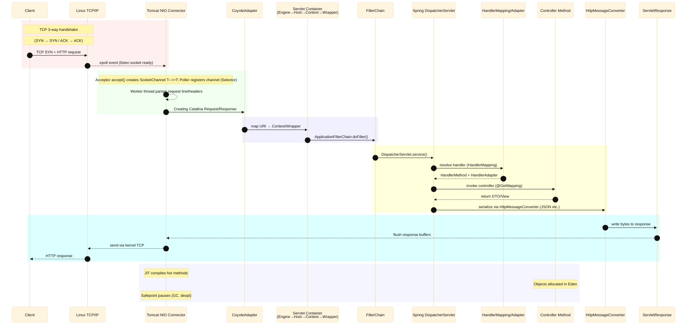

# Spring Framework HTTP Test

## Flow

## Network

- **3-way handshake**
  The TCP 3-way handshake is the process used to establish a reliable connection between two endpoints. It consists of three steps:

  1. **SYN**: The client sends a synchronization packet to request a connection.
  2. **SYN/ACK**: The server acknowledges the request and sends its own synchronization packet.
  3. **ACK**: The client acknowledges the server’s response, and the connection is established.
     This happens entirely in the **Linux kernel’s TCP/IP stack** before the application (Tomcat, Java) even sees the connection.

- **Tomcat NIO Connector**
  This is Tomcat’s component that handles network I/O using Java NIO (`java.nio` package).
  It consists of:

  * **Acceptor** – Calls `accept()` to retrieve a socket from the kernel’s accept queue.
  * **Poller** – Registers the socket with a `Selector` and waits for readiness events.
  * **Worker thread** – Reads/parses HTTP requests and passes them to the servlet container.
    NIO allows Tomcat to handle many thousands of connections with fewer threads.

- **epoll event**
  `epoll` is a Linux kernel system call for scalable I/O event notification.
  It lets a process register many file descriptors (e.g., sockets) and wait for them to become ready (readable, writable).
  Tomcat’s NIO **Poller** uses `epoll_wait()` under the hood to detect when a client socket has incoming data or can be written to.

## Tomcat NIO

- **Acceptor**
  - Listens on the server socket for incoming TCP connections.
  - When a client connects, `accept()` is called to create a new `SocketChannel`.
  - Its job is lightweight: just accept and hand off the connection to the `Poller`.
  - Usually runs in one or two dedicated threads.

- **Poller**
  - Monitors multiple `SocketChannel`s for readiness events using a `Selector` (based on Linux `epoll`).
  - Detects when a socket is ready for read or write without blocking.
  - When data is available, it creates a processing task and puts it into the **Worker** queue.
  - Non-blocking I/O allows one Poller thread to handle thousands of connections.

- **Worker**
  - A thread from the Tomcat **Worker Thread Pool**.
  - Retrieves tasks from the queue created by the Poller.
  - Parses HTTP request line and headers, and calls into Tomcat’s higher layers (via `CoyoteAdapter`).
  - Executes the request in the Servlet container / Spring MVC pipeline.

## Servlet Container

- **Engine**
  - The top-level container of Tomcat that processes requests handed off by the connector. It holds virtual hosts and coordinates request routing down the container hierarchy.
- **Host**
  - A virtual host (by hostname) within the Engine, representing a domain like `shop.example.com`. It allows multiple domains to be served by the same Tomcat instance.
- **Context**
  - A single web application (usually one WAR) mounted at a context path like `/app` under a Host. It contains the app’s resources, web.xml, and its servlets/filters/listeners.
- **Wrapper**
  - The container that “wraps” a single servlet (e.g., `DispatcherServlet`). It is the final step in the mapping chain that actually invokes the servlet’s `service()` method.
- **`ApplicationFilterChain.doFilter()`**
  - Executes all servlet filters that apply to the current request in order. Each filter runs its `doFilter()`, and when the chain is exhausted, it finally calls the target servlet’s `service()` (for Spring MVC, the `DispatcherServlet`).

## Spring MVC

- **DispatcherServlet**
  - The front controller in Spring MVC that receives all incoming HTTP requests, delegates to other components to handle them, and produces the HTTP response.
- **HandlerMapping**
  - A component that maps an incoming request to the appropriate handler (such as a controller method) based on URL, HTTP method, and other criteria.
- **HandlerAdapter**
  - A component that knows how to invoke a specific type of handler, performing tasks like parameter binding, validation, and handling the return value.
- **Controller Method**
  - A method inside a controller class, annotated with mappings (e.g., `@GetMapping`, `@PostMapping`), containing the business logic to process the request.
- **HttpMessageConverter**
  - A strategy interface for converting between Java objects and HTTP request/response bodies, handling serialization (e.g., to JSON) and deserialization.

## Response
- **Buffer**
  - A temporary memory area used to store data before it is read or written, allowing more efficient processing by reducing the number of direct I/O operations.

### JVM

- **JIT (Just-In-Time Compilation)**
  - A JVM feature that compiles frequently executed bytecode into native machine code at runtime, improving performance through optimizations such as inlining, loop unrolling, and escape analysis.
- **Eden**
  - A memory region in the Young Generation of the JVM heap where most new objects are initially allocated; short-lived objects are quickly collected, and survivors are promoted to the Old Generation.
- **Safepoint**
  - A state in which all application threads are paused so the JVM can perform global operations such as garbage collection, deoptimization, or class redefinition.